# Student Performance EDA and Risk Prediction

End-to-end data analysis and machine learning project on student academic performance.
Analyses key factors that influence student outcomes and predicts pass/fail risk using
logistic regression.

---

## Project Overview

Nearly 1 in 3 students in this dataset failed their final exam. This project digs into
why — analysing study habits, family background, past failures, and mid-term grades to
understand what drives student outcomes. A logistic regression model is then built to
predict which students are at risk of failing before the final exam, enabling early
intervention before results are beyond saving.

---

## Tools and Technologies

| Tool | Purpose |
|------|---------|
| MySQL | Data storage and SQL analysis |
| Python (pandas, seaborn, matplotlib) | Exploratory data analysis |
| scikit-learn | Logistic regression model |
| Microsoft Excel | Pivot table dashboard |
| Power BI | Interactive reporting dashboard |
| Jupyter Notebook | EDA and ML notebooks |
| GitHub | Version control and portfolio |

---

## Dataset

- **Source:** UCI Machine Learning Repository
- **Link:** https://archive.ics.uci.edu/dataset/320/student+performance
- **File used:** student-mat.csv (Math subject)
- **Size:** 395 students, 33 columns
- **Null values:** 0 — dataset is clean and complete

---

## Key Findings

### From SQL Analysis
- **32.9% of students failed** (130 out of 395) — nearly 1 in 3 at risk
- **38 students scored 0** on the final exam — complete disengagement cases
- Students with **1 past failure** have their pass rate cut almost in half (75% → 48%)
- Students with **2+ past failures** have less than 25% chance of passing
- Students whose mothers have higher education pass at **74.8%** vs **57.6%** for primary education — a 17% gap
- Students who want higher education pass at **68.8%** vs only **35%** for those who don't

---

### From Python EDA

**Overall pass/fail distribution**
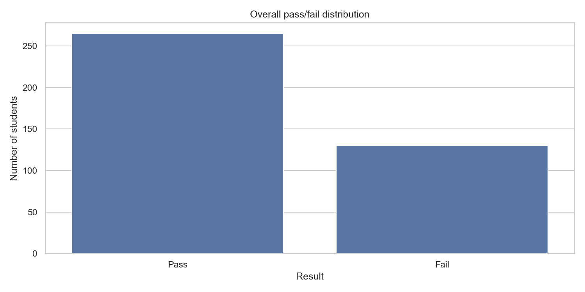
- 265 students passed (67.1%) and 130 failed (32.9%)
- nearly 1 in 3 students is failing — significant at-risk population

---

**Grade distribution**
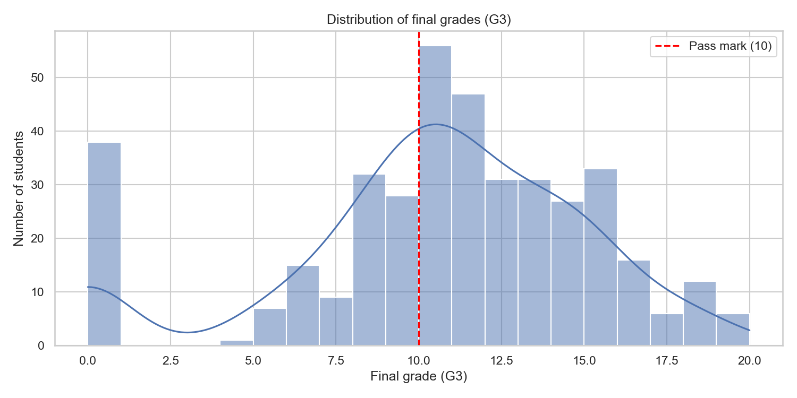
- large spike at 0 — 38 students completely disengaged
- distribution is roughly normal between grades 8-16
- the spike at 0 skews the class average down significantly

---

**Study time vs final grade**
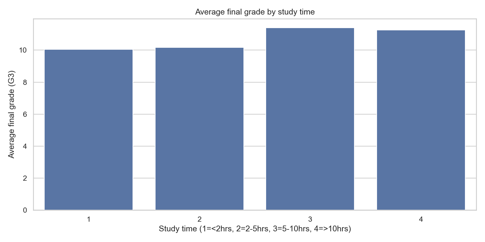
- grades improve as study time increases from 1 to 3
- studytime 4 dips slightly — possibly burnout or weaker students trying harder to compensate
- majority of students (198) are in studytime 2 — significant room for improvement

---

**Pass rate by past failures**
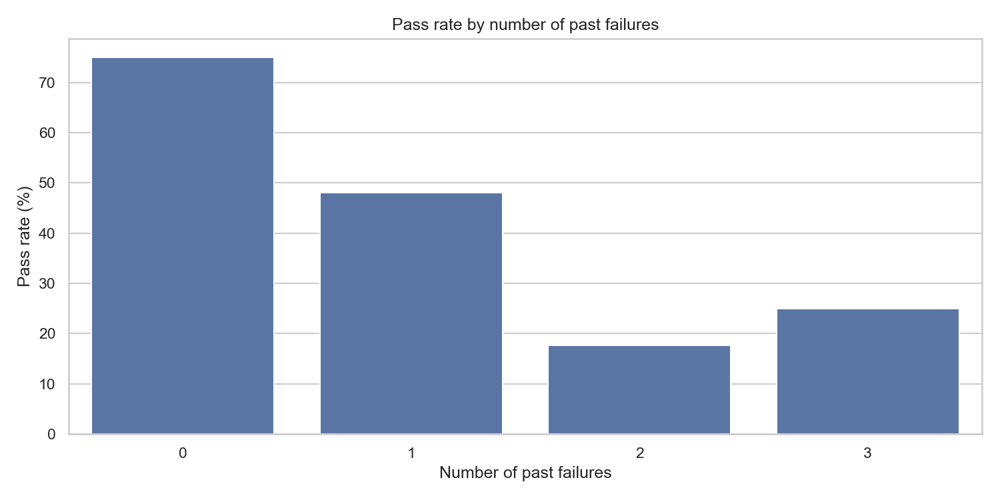
- 0 past failures: 75% pass rate
- 1 past failure: drops to 48% — almost halved
- 2+ failures: below 25% chance of passing
- past failures is the strongest risk indicator in the dataset

---

**Correlation heatmap**
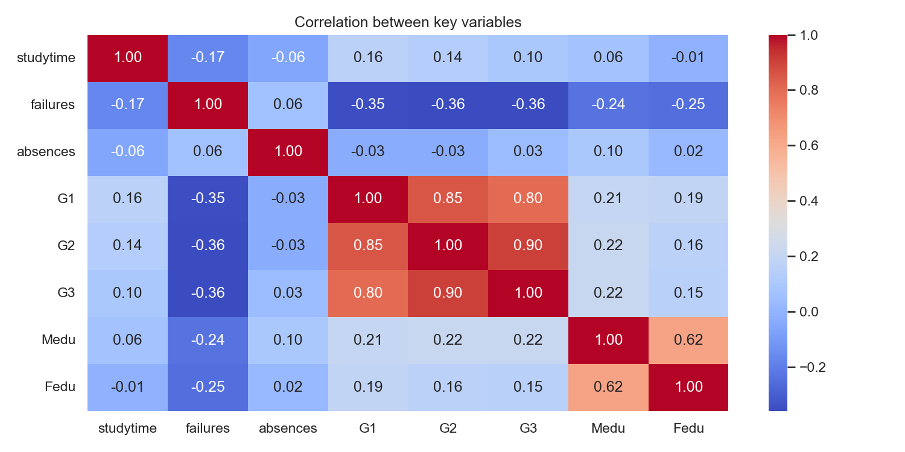
- G1 and G2 are very strongly correlated with G3
- failures has a clear negative correlation with G3
- absences has a weak negative correlation — not as strong as expected
- parental education (Medu, Fedu) mildly positively correlated with G3

---

**Absences vs final grade**
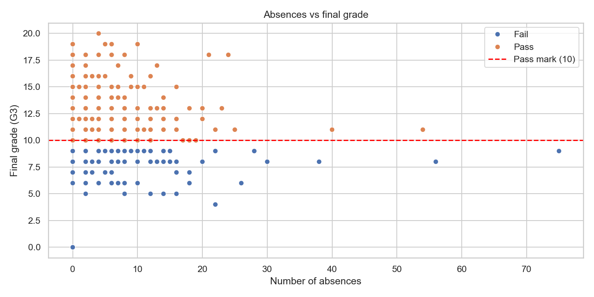
- students with very high absences (30+) are almost all below the pass line
- many students with low absences also fail — absences alone doesn't explain failure
- the student with 75 absences is clearly visible as an extreme outlier

---

### From ML Model

**Confusion Matrix**
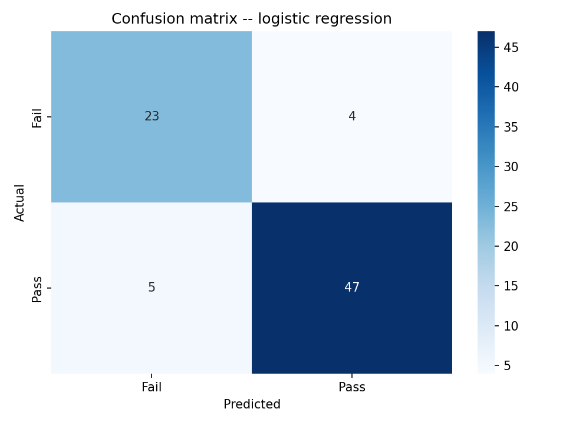

**Feature Importance**
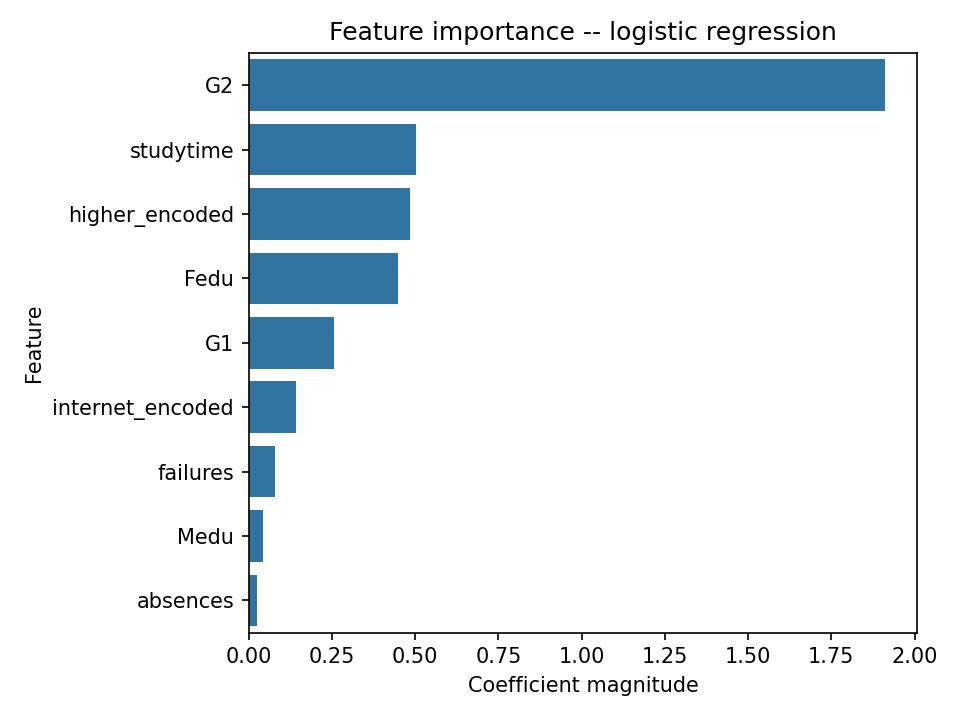
```
Accuracy:  88.6%

              precision    recall    f1-score
Fail            0.82        0.85       0.84
Pass            0.92        0.90       0.91
```

**What the model tells us practically:**

- The model correctly identifies **85% of students who will fail** — meaning if run
  after Period 2 results are published, it catches 85 out of every 100 at-risk students
  before the final exam

- **G2 (Period 2 grade) dominates all other features** by a large margin — its
  coefficient is nearly 4x larger than the next feature. This means the single most
  actionable step a school can take is monitoring Period 2 results closely and
  intervening immediately for students who score below 10

- **Past failures ranked surprisingly low** in the model despite showing dramatic
  effects in SQL analysis. This is because G2 already encodes the effect of failures
  indirectly — a student with multiple failures will naturally have a low G2 score

- **Study time and aspiration matter** even after controlling for grades — students
  who study more and want to pursue higher education have better outcomes independent
  of their mid-term scores

**Recommended intervention steps based on findings:**
1. Flag any student scoring below 10 in Period 2 immediately — highest priority
2. Cross-check flagged students for past failures — doubles the risk
3. Check study time and aspiration — students studying less than 2hrs with no higher
   education goals need counselling not just academic support
4. Monitor absences continuously — students crossing 15+ absences should be contacted
   regardless of current grades

---

## Dashboards

### Excel Dashboard
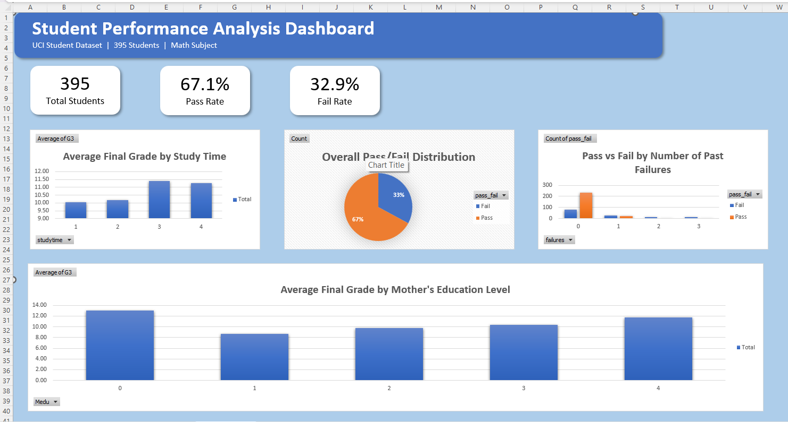

### Power BI — Overview Page
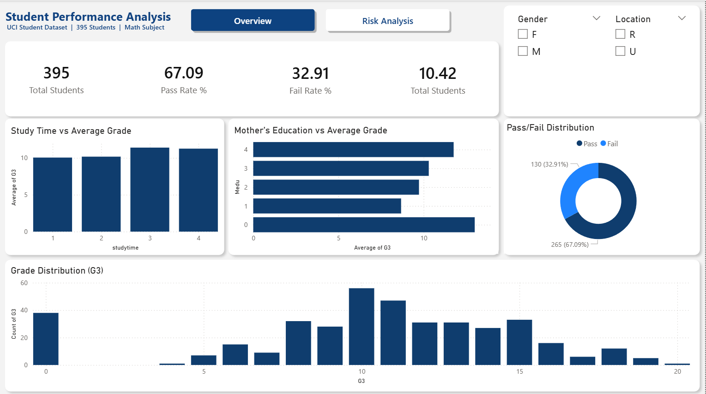

### Power BI — Risk Analysis Page
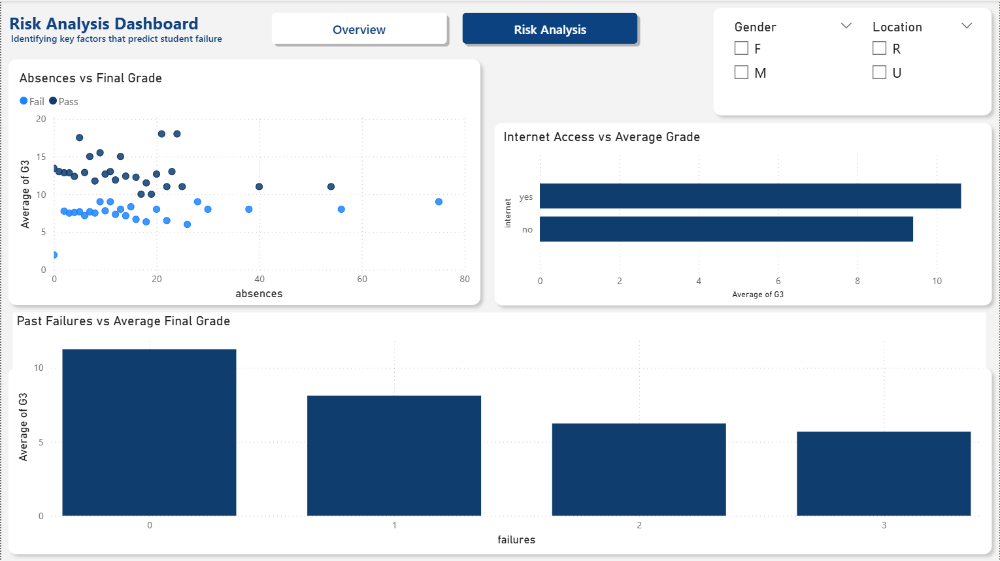

---

## Author

**Your Name**
[LinkedIn](https://linkedin.com/in/devansh-patil) | [GitHub](https://github.com/devanshh18)
